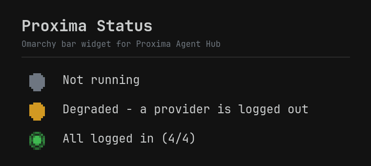

# Proxima Status (Omarchy plugin)

An [Omarchy](https://omarchy.org) bar widget that shows the health of
[Proxima](https://github.com/Zen4-bit/Proxima) Agent Hub at a glance, and gives
you one-click access to its window.



## What it shows

A single status dot in the bar, always visible:

| State | Colour | Meaning |
|---|---|---|
| Grey | `#6e7681` | Proxima is not running |
| Green | `#3fb950` | Running, all four providers logged in |
| Yellow | `#d29922` | Running, one or more providers logged out |

Hover the dot for a tooltip with the count and the names of any logged-out
providers (e.g. `Proxima — 3/4: gemini logged out`).

- **Click while running** — shows and focuses the Agent Hub window, floating,
  centred, and raised above other windows. Repeat clicks are idempotent.
- **Click while not running** — launches the Agent Hub from your local Proxima
  checkout and moves its window to workspace 10. The dot flips grey →
  yellow/green once the hub's IPC is up.
- **Middle-click** — force an immediate status refresh.

## Requirements

- Omarchy (Quattro) with the Quickshell shell.
- A local [Proxima](https://github.com/Zen4-bit/Proxima) checkout (the widget
  reads its IPC socket and launches its Electron app). Set `proximaDir` if it
  is not at `~/Work/Proxima`.
- Python 3 (stdlib only — no packages), `hyprctl` for window placement.

The widget does not modify Proxima or its configuration. It reads
`~/.config/proxima/ipc-port.json` and `ipc-token.json` to talk to the running
hub's IPC socket on `127.0.0.1`.

## Install

```sh
omarchy plugin add https://github.com/mrc04d/omarchy-proxima.git --enable
```

If it does not appear, place it explicitly:

```sh
omarchy bar move io.github.mrc04d.proxima --section right
```

## Configure

Settings live in the widget's entry in `~/.config/omarchy/shell.json`; set
them with `omarchy bar set`:

| Key | Default | What it does |
|---|---|---|
| `pollIntervalSec` | `30` | How often provider login state is checked (10–120) |
| `proximaDir` | `~/Work/Proxima` | Path to the Proxima checkout used when launching |

```sh
omarchy bar set io.github.mrc04d.proxima pollIntervalSec 60
omarchy bar set io.github.mrc04d.proxima proximaDir ~/code/Proxima
```

## How it works

`BarWidget.qml` polls `helpers/proxima-helper.py status` on a timer. The helper
speaks Proxima's newline-delimited JSON IPC protocol: it asks `isLoggedIn` for
each of `claude`, `chatgpt`, `gemini`, and `perplexity`, and probes the socket
for liveness. A single JSON line comes back and drives the dot colour, tooltip,
and visibility.

The `show` subcommand calls the hub's `showWindow` IPC action, then places the
window with transient `hyprctl` lua dispatchers (`hl.dsp.focus`,
`hl.dsp.window.float`, `hl.dsp.window.bring_to_top`) — no persistent Hyprland
rules are written. When the hub is down it spawns the local Electron app
detached, waits for IPC, and moves the window to workspace 10.

Both subcommands accept `PROXIMA_DRY_RUN=1` to skip real `hyprctl` calls, and
`PROXIMA_TEST_PORT` to target a fake IPC server. These exist for the tests.

## Tests

Stdlib only, no test runner required:

```sh
python3 tests/test_status.py
python3 tests/test_show.py
```

## Remove

```sh
omarchy plugin remove io.github.mrc04d.proxima
```

## Limitations

- The dot only refreshes once per poll interval, so a state change can take up
  to `pollIntervalSec` to show.
- Login detection reflects Proxima's own `isLoggedIn` check against its live
  provider views; a hub that is reachable but logged out everywhere shows
  yellow, not grey.
- Launching uses an Electron checkout, so `proximaDir` must point at a working
  Proxima source tree.

## Credits

Built for [Proxima](https://github.com/Zen4-bit/Proxima) and Omarchy.
Licensed under the MIT License — see [LICENSE](LICENSE).
